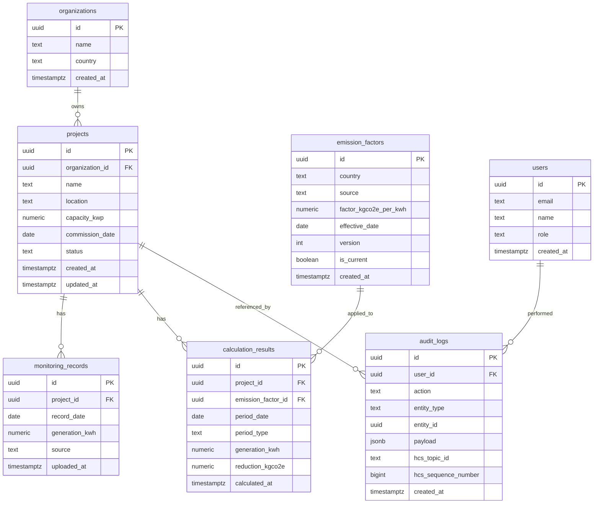

# Carbon Ready — Sprint 1 Design Spec

**Date:** 2026-05-27
**Status:** Draft for review
**Sprint:** 1 (MVP foundation)
**Author:** Product / Architecture
**Scope:** Solar Rooftop dMRV — register projects, upload monitoring data, calculate carbon reduction, view dashboard

---

## 1. Product Requirements

### 1.1 Vision
Replace manual Excel-based MRV (Monitoring, Reporting, Verification) for distributed solar rooftop projects with a digital, auditable, API-first platform that is ready to integrate with Hedera Guardian and blockchain-anchored audit trails in later sprints.

### 1.2 Sprint 1 Goal
Ship a clickable, single-tenant MVP that proves the end-to-end happy path:
**Create Project → Upload Daily Generation CSV → Calculate Carbon Reduction → View Dashboard → See Audit Trail.**

### 1.3 In-Scope (Sprint 1)
| # | Module | Capability |
|---|--------|-----------|
| 1 | Project Management | Create / Edit / View solar projects |
| 2 | Monitoring Data | CSV upload with validation (duplicate, missing, negative) |
| 3 | Emission Factors | CRUD with versioning by `effective_date` |
| 4 | Calculation Engine | `kgCO2e = kWh × EF`; daily / monthly / total rollups |
| 5 | Dashboard | KPIs + daily generation chart + monthly reduction chart |
| 6 | Audit Trail | Append-only log of project / upload / calculation events |

### 1.4 Out-of-Scope (deferred to later sprints)
- Real authentication / SSO (UI shows role badge but does not enforce)
- Multi-tenant isolation
- Hedera Guardian / blockchain anchoring (architecture is ready, not wired)
- Verifier workflow, issuance, retirement, registry sync
- IoT inverter telemetry (only CSV in Sprint 1)
- Email / notification system
- PDF / verifier report export

### 1.5 Non-Functional Requirements
- **Responsive** — works ≥ 360px width (mobile), optimised for ≥ 1280px desktop
- **API-first** — every UI action maps to a documented REST endpoint (stubbed in Sprint 1, real in Sprint 2)
- **Role-ready** — UI exposes `role` on the user object; RBAC checks are gated behind a single helper so Sprint 2 can flip it on
- **Hedera-ready** — `audit_logs` table includes nullable `hcs_topic_id` and `hcs_sequence_number` columns so Sprint 3 can anchor entries without migration churn
- **Accessibility** — semantic HTML, keyboard navigation, WCAG 2.1 AA colour contrast
- **Performance** — dashboard first paint < 1.5s on 1M of seed data; CSV parse for 5,000 rows < 2s

### 1.6 Success Metrics
- 100% of Sprint 1 user stories pass acceptance criteria
- CSV with 365 rows parses + validates + renders in < 2s
- Dashboard renders with seed data on first load with no console errors
- Every state-changing action produces exactly one `audit_logs` entry

---

## 2. User Stories

### Personas
- **Project Owner (PO)** — registers projects, uploads monitoring data
- **ESG Manager (EM)** — reviews dashboards, exports reports (future)
- **Verifier (V)** — audits the trail (future sprint)
- **Admin (A)** — manages emission factor master data

### Stories

| ID | Story | Persona | Priority |
|----|-------|---------|----------|
| US-01 | As a PO, I can create a new solar project so that I can begin tracking it. | PO | Must |
| US-02 | As a PO, I can edit project details when commissioning info changes. | PO | Must |
| US-03 | As a PO, I can view a project's full detail page including its generation history. | PO | Must |
| US-04 | As a PO, I can upload a CSV of daily generation so that I do not retype data. | PO | Must |
| US-05 | As a PO, I see validation errors (duplicate / missing / negative) before any data is saved. | PO | Must |
| US-06 | As an A, I can manage emission factors per country/source with effective dates. | A | Must |
| US-07 | As an A, I can supersede an emission factor by adding a newer version without losing history. | A | Must |
| US-08 | As an EM, I can trigger a carbon calculation and see daily / monthly / total reduction. | EM | Must |
| US-09 | As an EM, I see a dashboard with total generation, total tCO2e, active project count, and latest upload date. | EM | Must |
| US-10 | As an EM, I see a daily generation trend chart and a monthly carbon reduction trend chart. | EM | Must |
| US-11 | As a V (future-facing), I can view a chronological audit log of all state changes filtered by user / entity / action. | V | Must |
| US-12 | As any user, the app is usable on a phone or tablet. | All | Should |

---

## 3. Database Schema

Target DB: **PostgreSQL** (Sprint 2). Sprint 1 uses an in-memory Zustand store with the **same shape** so migration is mechanical.

### 3.1 ER Diagram (Mermaid)



### 3.2 Table DDL (PostgreSQL)

```sql
CREATE TABLE organizations (
  id              uuid PRIMARY KEY DEFAULT gen_random_uuid(),
  name            text NOT NULL,
  country         text NOT NULL,
  created_at      timestamptz NOT NULL DEFAULT now()
);

CREATE TABLE users (
  id              uuid PRIMARY KEY DEFAULT gen_random_uuid(),
  email           text UNIQUE NOT NULL,
  name            text NOT NULL,
  role            text NOT NULL CHECK (role IN ('admin','project_owner','esg_manager','verifier')),
  created_at      timestamptz NOT NULL DEFAULT now()
);

CREATE TABLE projects (
  id              uuid PRIMARY KEY DEFAULT gen_random_uuid(),
  organization_id uuid NOT NULL REFERENCES organizations(id),
  name            text NOT NULL,
  location        text NOT NULL,
  capacity_kwp    numeric(12,2) NOT NULL CHECK (capacity_kwp > 0),
  commission_date date NOT NULL,
  status          text NOT NULL CHECK (status IN ('draft','active','suspended','retired')),
  created_at      timestamptz NOT NULL DEFAULT now(),
  updated_at      timestamptz NOT NULL DEFAULT now()
);

CREATE TABLE monitoring_records (
  id              uuid PRIMARY KEY DEFAULT gen_random_uuid(),
  project_id      uuid NOT NULL REFERENCES projects(id) ON DELETE CASCADE,
  record_date     date NOT NULL,
  generation_kwh  numeric(14,3) NOT NULL CHECK (generation_kwh >= 0),
  source          text NOT NULL DEFAULT 'csv_upload',
  uploaded_at     timestamptz NOT NULL DEFAULT now(),
  UNIQUE (project_id, record_date)
);

CREATE TABLE emission_factors (
  id              uuid PRIMARY KEY DEFAULT gen_random_uuid(),
  country         text NOT NULL,
  source          text NOT NULL,
  factor_kgco2e_per_kwh numeric(10,6) NOT NULL CHECK (factor_kgco2e_per_kwh >= 0),
  effective_date  date NOT NULL,
  version         int  NOT NULL DEFAULT 1,
  is_current      boolean NOT NULL DEFAULT true,
  created_at      timestamptz NOT NULL DEFAULT now(),
  UNIQUE (country, source, version)
);

CREATE TABLE calculation_results (
  id              uuid PRIMARY KEY DEFAULT gen_random_uuid(),
  project_id      uuid NOT NULL REFERENCES projects(id) ON DELETE CASCADE,
  emission_factor_id uuid NOT NULL REFERENCES emission_factors(id),
  period_date     date NOT NULL,
  period_type     text NOT NULL CHECK (period_type IN ('daily','monthly','total')),
  generation_kwh  numeric(14,3) NOT NULL,
  reduction_kgco2e numeric(14,3) NOT NULL,
  calculated_at   timestamptz NOT NULL DEFAULT now(),
  UNIQUE (project_id, period_date, period_type)
);

CREATE TABLE audit_logs (
  id              uuid PRIMARY KEY DEFAULT gen_random_uuid(),
  user_id         uuid REFERENCES users(id),
  action          text NOT NULL,           -- e.g. PROJECT_CREATED, CSV_UPLOADED
  entity_type     text NOT NULL,           -- project | monitoring | factor | calculation
  entity_id       uuid,
  payload         jsonb NOT NULL DEFAULT '{}',
  hcs_topic_id    text,                    -- Hedera Consensus Service topic, nullable until Sprint 3
  hcs_sequence_number bigint,
  created_at      timestamptz NOT NULL DEFAULT now()
);

CREATE INDEX idx_monitoring_project_date ON monitoring_records (project_id, record_date DESC);
CREATE INDEX idx_calc_project_period     ON calculation_results (project_id, period_type, period_date DESC);
CREATE INDEX idx_audit_created           ON audit_logs (created_at DESC);
CREATE INDEX idx_audit_entity            ON audit_logs (entity_type, entity_id);
```

---

## 4. API Design

REST, JSON, base URL `/api/v1`. Auth header `Authorization: Bearer <jwt>` (stubbed in Sprint 1). All timestamps ISO-8601 UTC.

### 4.1 Endpoint Summary
| Method | Path | Purpose |
|--------|------|---------|
| GET    | `/projects` | List projects |
| POST   | `/projects` | Create project |
| GET    | `/projects/{id}` | Project detail |
| PATCH  | `/projects/{id}` | Update project |
| POST   | `/projects/{id}/monitoring/upload` | Upload monitoring CSV |
| GET    | `/projects/{id}/monitoring` | List monitoring records |
| POST   | `/projects/{id}/calculate` | Run carbon calculation |
| GET    | `/projects/{id}/calculations` | List calculation results |
| GET    | `/emission-factors` | List factors |
| POST   | `/emission-factors` | Add factor (creates new version, marks previous `is_current=false`) |
| GET    | `/dashboard/summary` | KPIs + chart series |
| GET    | `/audit-logs` | Filtered audit log |

### 4.2 Selected Specs

**POST `/projects`**
```jsonc
// Request
{
  "organization_id": "uuid",
  "name": "Pune Solar Rooftop Phase 1",
  "location": "Pune, India",
  "capacity_kwp": 250.5,
  "commission_date": "2025-03-15",
  "status": "active"
}
// 201 Response
{
  "id": "uuid",
  "name": "...", "location": "...", "capacity_kwp": 250.5,
  "commission_date": "2025-03-15", "status": "active",
  "created_at": "2026-05-27T10:00:00Z"
}
// 400 if missing required field, 409 if duplicate name within org
```

**POST `/projects/{id}/monitoring/upload`** — multipart `file=<csv>`
```jsonc
// 200 Response
{
  "accepted": 178,
  "rejected": 4,
  "errors": [
    { "row": 12, "code": "DUPLICATE_DATE",  "date": "2026-04-12" },
    { "row": 31, "code": "NEGATIVE_VALUE",  "date": "2026-04-15", "value": -3.2 },
    { "row": 52, "code": "MISSING_DATE" },
    { "row": 77, "code": "INVALID_NUMBER",  "value": "abc" }
  ],
  "uploaded_at": "2026-05-27T10:05:00Z"
}
```
*If `accepted == 0` → status 422 with the same body. If any row is rejected the request is "all-or-nothing-per-row" — good rows are saved, bad rows are reported.*

**POST `/projects/{id}/calculate`**
```jsonc
// Request
{ "from": "2026-01-01", "to": "2026-05-31" }   // optional, defaults to all-time
// 200 Response
{
  "project_id": "uuid",
  "emission_factor_id": "uuid",
  "totals": { "generation_kwh": 184523.4, "reduction_kgco2e": 152255.4, "reduction_tco2e": 152.26 },
  "daily":   [ { "date": "2026-01-01", "generation_kwh": 1234.5, "reduction_kgco2e": 1018.5 }, ... ],
  "monthly": [ { "period": "2026-01",  "generation_kwh": 36210.0, "reduction_kgco2e": 29873.3 }, ... ]
}
```

**GET `/dashboard/summary`**
```jsonc
{
  "kpis": {
    "total_generation_kwh": 482310,
    "total_reduction_tco2e": 397.9,
    "active_projects": 3,
    "latest_upload_at": "2026-05-26T18:30:00Z"
  },
  "daily_generation":   [ { "date": "2026-05-01", "kwh": 1820 }, ... ],
  "monthly_reduction":  [ { "period": "2026-01", "tco2e": 64.2 }, ... ]
}
```

**GET `/audit-logs?entity=project&user=...&from=...&to=...&limit=50`**
```jsonc
{
  "items": [
    {
      "id": "uuid",
      "user": { "id": "uuid", "name": "Asha Iyer", "role": "project_owner" },
      "action": "PROJECT_CREATED",
      "entity_type": "project",
      "entity_id": "uuid",
      "payload": { "name": "Pune Solar Rooftop Phase 1" },
      "created_at": "2026-05-20T09:12:00Z"
    }
  ],
  "next_cursor": null
}
```

### 4.3 Error Envelope
```jsonc
{ "error": { "code": "VALIDATION_ERROR", "message": "...", "details": { ... } } }
```

---

## 5. UI/UX Wireframes

### 5.1 Layout Primitives
- Fixed left sidebar (240px) — logo, nav links (Dashboard, Projects, Upload, Calculations, Emission Factors, Audit Log), user chip at bottom
- Top bar (64px) — page title + breadcrumb, global search (UI only), notifications bell, role badge
- Content area — max-width 1440px, 32px gutter

### 5.2 Dashboard

```
┌────────┬──────────────────────────────────────────────────────────────────┐
│        │  Dashboard                                          [ESG Mgr ▾]  │
│  LOGO  ├──────────────────────────────────────────────────────────────────┤
│        │  ┌─KPI──┐ ┌─KPI──┐ ┌─KPI──┐ ┌─KPI──┐                            │
│  ▸ Dash│  │482k  │ │398   │ │  3   │ │May 26│                            │
│  ▸ Proj│  │kWh   │ │tCO2e │ │Active│ │ 6:30P│                            │
│  ▸ Uplo│  │Gen   │ │Reduc │ │Projs │ │Upload│                            │
│  ▸ Calc│  └──────┘ └──────┘ └──────┘ └──────┘                            │
│  ▸ EF  │                                                                  │
│  ▸ Audit│ ┌─Daily Generation Trend───────────────────────────┐            │
│        │  │      ╱╲     ╱╲                                  │            │
│        │  │   ╱╲╱  ╲╱╲╱╲╱  ╲ ╱╲╱╲                          │            │
│  ──────│  └──────────────────────────────────────────────────┘            │
│  user  │                                                                  │
│  Asha  │  ┌─Monthly Reduction tCO2e──┐ ┌─Recent Activity────┐            │
│  ESG Mg│  │ ▌  ▌  ▌  ▌  ▌            │ │ • Asha uploaded... │            │
│        │  │ ▌  ▌  ▌  ▌  ▌            │ │ • EF v2 added...   │            │
└────────┴──┴──────────────────────────┴─┴────────────────────┘            │
```

### 5.3 Projects List

```
┌──────────────────────────────────────────────────────────────────┐
│  Projects                                       [+ New Project]  │
├──────────────────────────────────────────────────────────────────┤
│  Search ▢   Status: All ▾   Country: All ▾                       │
├──────────────────────────────────────────────────────────────────┤
│  Name                  Location     kWp   Status   Last upload   │
│  ─────────────────────────────────────────────────────────────── │
│  Pune Rooftop Ph 1     Pune, IN     250   ●Active  May 26        │
│  Bangkok Industrial    BKK, TH      820   ●Active  May 25        │
│  Hanoi Warehouse       HN, VN       510   ●Draft   —             │
└──────────────────────────────────────────────────────────────────┘
```

### 5.4 Upload Page

```
┌──────────────────────────────────────────────────────────────────┐
│  Upload Monitoring Data — Pune Rooftop Ph 1                      │
├──────────────────────────────────────────────────────────────────┤
│  ┌───────────────────────────────────────────────────────────┐   │
│  │                                                           │   │
│  │     ⬆  Drop CSV here, or click to browse                  │   │
│  │     Expected columns: Date, Generation_kWh                │   │
│  │                                                           │   │
│  └───────────────────────────────────────────────────────────┘   │
│                                                                  │
│  Validation Report                                               │
│  ✅ 178 accepted    ❌ 4 rejected                                 │
│  ┌─ Row ─ Code ──────────── Detail ────────────────────────┐    │
│  │  12   DUPLICATE_DATE     2026-04-12                      │    │
│  │  31   NEGATIVE_VALUE     -3.2 kWh                        │    │
│  │  52   MISSING_DATE       —                                │    │
│  │  77   INVALID_NUMBER     "abc"                            │    │
│  └──────────────────────────────────────────────────────────┘    │
│                            [Cancel]  [Confirm Upload 178 rows]   │
└──────────────────────────────────────────────────────────────────┘
```

### 5.5 Calculation Result Page

```
┌──────────────────────────────────────────────────────────────────┐
│  Calculations — Pune Rooftop Ph 1     [Run Calculation ↻]        │
│  EF: India / CEA v2 (0.82 kgCO2e/kWh, effective 2025-04-01)      │
├──────────────────────────────────────────────────────────────────┤
│  Total Generation  184,523 kWh                                   │
│  Total Reduction   152.26 tCO2e                                  │
│  Period            2026-01-01 → 2026-05-31                       │
├──────────────────────────────────────────────────────────────────┤
│  Tabs: [ Daily ]  [ Monthly ]  [ Total ]                         │
│  ─────────────────────────────────────────                       │
│  Date         kWh        tCO2e                                   │
│  2026-05-01   1,820.4    1.49                                    │
│  2026-05-02   1,765.1    1.45                                    │
│  ...                                                             │
└──────────────────────────────────────────────────────────────────┘
```

---

## 6. System Architecture

```
        ┌──────────────┐
        │     User     │
        └──────┬───────┘
               │ HTTPS
               ▼
   ┌────────────────────────┐
   │   Web Application      │   React + Tailwind (Sprint 1)
   │   (Vite SPA)           │   Next.js SSR option in Sprint 2
   └──────┬─────────────────┘
          │ REST /api/v1 (JSON)
          ▼
   ┌────────────────────────────────────────────────────────┐
   │                  API Gateway / BFF                     │
   │                  (Sprint 2: Node/Express or NestJS)    │
   └──┬─────────────┬─────────────┬──────────────┬──────────┘
      │             │             │              │
      ▼             ▼             ▼              ▼
 ┌─────────┐  ┌──────────┐  ┌──────────┐  ┌────────────┐
 │ Project │  │Monitoring│  │  Carbon  │  │   Audit    │
 │ Service │  │ Service  │  │  Calc    │  │  Service   │
 │         │  │ (CSV val)│  │  Engine  │  │            │
 └────┬────┘  └─────┬────┘  └─────┬────┘  └─────┬──────┘
      │             │             │              │
      └─────────────┴──────┬──────┴──────────────┘
                           ▼
                  ┌──────────────────┐
                  │   PostgreSQL     │   (Sprint 2)
                  └────────┬─────────┘
                           │
                           ▼
                  ┌──────────────────┐
                  │    Dashboard     │   (read-model / materialised views)
                  └──────────────────┘

  ┌────────────────────────────────────────────────────────┐
  │  Future (Sprint 3+):                                   │
  │   • Hedera Guardian — policy engine, methodology       │
  │   • HCS — append audit_logs to Hedera Consensus Service│
  │   • Token Service — issue / retire carbon credits      │
  └────────────────────────────────────────────────────────┘
```

**Sprint 1 deviation:** Instead of a real backend, the SPA talks to a stubbed `api.ts` module that reads/writes a Zustand store persisted to `localStorage`. The store shape exactly matches the documented REST contracts so Sprint 2 swaps the implementation, not the consumers.

---

## 7. Sprint Backlog

Two-week sprint, single full-stack engineer (or 2 engineers half-time). Estimates in story points (Fibonacci).

| # | Ticket | Story | Pts | Dep |
|---|--------|-------|-----|-----|
| S1-01 | Bootstrap Vite + React + TS + Tailwind project | — | 2 | — |
| S1-02 | App shell: sidebar, top bar, routing scaffold | US-12 | 3 | S1-01 |
| S1-03 | Design tokens: colours, spacing, typography in `tailwind.config.ts` | — | 2 | S1-01 |
| S1-04 | Component kit: Button, Input, Select, Modal, Table, Badge, Card, FileDrop | — | 5 | S1-03 |
| S1-05 | Zustand store slices + stubbed `api.ts` matching documented contracts | — | 3 | S1-01 |
| S1-06 | Seed data: 3 projects, 6 months of records, 3 emission factors | — | 2 | S1-05 |
| S1-07 | Projects list + create modal + edit drawer + detail page | US-01..03 | 5 | S1-04, S1-05 |
| S1-08 | CSV parser + validator (`lib/csv.ts`) + 12 unit tests | US-04, US-05 | 5 | S1-05 |
| S1-09 | Upload page wired to parser + validation report UI | US-04, US-05 | 3 | S1-08 |
| S1-10 | Emission factor list + add-version flow (auto `is_current` flip) | US-06, US-07 | 3 | S1-04, S1-05 |
| S1-11 | Calculation engine (`lib/calc.ts`) + 8 unit tests (daily/monthly/total) | US-08 | 5 | S1-08 |
| S1-12 | Calculations page (tabs + table + chart) | US-08 | 3 | S1-11 |
| S1-13 | Dashboard KPIs + 2 Recharts (daily area, monthly bar) + recent activity | US-09, US-10 | 5 | S1-11 |
| S1-14 | Audit log slice + automatic write on every mutation | US-11 | 3 | S1-05 |
| S1-15 | Audit log page with filters (user / entity / action / date) | US-11 | 3 | S1-14 |
| S1-16 | Mobile/responsive pass + a11y sweep (focus rings, aria) | US-12 | 3 | all UI |
| S1-17 | README with run instructions + screenshots | — | 1 | all |
| **Total** | | | **56** | |

---

## 8. Acceptance Criteria

### US-01 / US-02 / US-03 — Project CRUD
- **GIVEN** I am on `/projects` **WHEN** I click "+ New Project" and submit valid fields **THEN** the project appears in the list and an `audit_logs` entry with `action=PROJECT_CREATED` is written.
- **WHEN** I submit with `capacity_kwp <= 0` or empty name **THEN** form shows inline validation errors and no record is created.
- **WHEN** I edit a project and save **THEN** `updated_at` changes and an `audit_logs` entry with `action=PROJECT_UPDATED` is written including changed fields in `payload`.

### US-04 / US-05 — CSV Upload
- **GIVEN** I drop a CSV with columns `Date, Generation_kWh` **THEN** the parser reports per-row outcomes within 2s for ≤ 5,000 rows.
- Validation must detect: `DUPLICATE_DATE` (within file *or* against existing records), `MISSING_DATE`, `NEGATIVE_VALUE`, `INVALID_NUMBER`, `INVALID_DATE`.
- Valid rows are committed; invalid rows are reported and not committed.
- One `audit_logs` entry with `action=CSV_UPLOADED` is written per upload, including `accepted` and `rejected` counts in `payload`.

### US-06 / US-07 — Emission Factors
- Adding a new factor for an existing `(country, source)` increments `version`, sets `is_current=true`, and flips the previous version's `is_current=false` atomically.
- The factor list shows current and historical versions distinguishable by a "Current" badge.

### US-08 — Calculation
- The engine produces `reduction_kgco2e = generation_kwh × factor_kgco2e_per_kwh` per day, then sums to monthly and total.
- The engine picks the emission factor whose `effective_date <= record_date` and is the latest version for that country/source.
- An `audit_logs` entry with `action=CALCULATION_EXECUTED` is written per run including the EF id used.

### US-09 / US-10 — Dashboard
- KPI tiles show non-zero values when seed data is loaded.
- Daily generation chart renders ≥ 30 data points.
- Monthly reduction chart renders ≥ 3 months.
- "Latest upload date" matches the max `uploaded_at` across all projects.

### US-11 — Audit Log
- Every state-changing action (project create/update, CSV upload, factor add, calculation run) results in exactly one log entry.
- Filters by user, entity type, action, and date range all work and are combinable.
- Log is sorted newest-first by default.

### US-12 — Responsive
- All pages usable at 360px width: sidebar collapses to a hamburger, tables become horizontally scrollable cards, charts shrink without overflow.
- No horizontal page scroll at any breakpoint ≥ 360px.

### NFR — Audit & Hedera-readiness
- `audit_logs` rows are append-only (no UPDATE/DELETE paths in the API).
- `audit_logs.hcs_topic_id` and `hcs_sequence_number` are present in the schema even though null in Sprint 1.

---

## 9. Risks & Open Questions

| Risk | Impact | Mitigation |
|------|--------|------------|
| In-memory store loses data on refresh | Demo fragility | Persist Zustand to `localStorage`; seed re-hydrates if empty |
| Emission factor selection logic complexity grows | Bugs in calc | Centralise EF lookup in `lib/calc.ts` with unit tests covering version transitions |
| CSV format drift (encoding, BOM, separator) | Upload failures | Use PapaParse; document expected format in UI; reject unknown delimiters with clear error |
| Hedera anchoring schema changes | Migration churn | Already added nullable HCS columns to `audit_logs` |

**Open questions for Sprint 2 planning (not blocking Sprint 1):**
- Auth provider — Auth0, Clerk, or self-hosted Keycloak?
- Multi-tenant strategy — schema-per-tenant vs row-level security?
- Methodology choice — CDM ACM0002 vs Verra VM0007 vs Gold Standard for solar?

---

## 10. Definition of Done (Sprint 1)
- [ ] All 17 backlog tickets closed
- [ ] All acceptance criteria pass manual QA against seed data
- [ ] Unit tests for `lib/csv.ts` and `lib/calc.ts` (≥ 20 tests, 100% green)
- [ ] No console errors or React warnings on any page
- [ ] Lighthouse: Performance ≥ 85, Accessibility ≥ 90 on Dashboard
- [ ] README covers install / run / sample-data reset
- [ ] Demo recording (≤ 3 min) walking through the happy path
